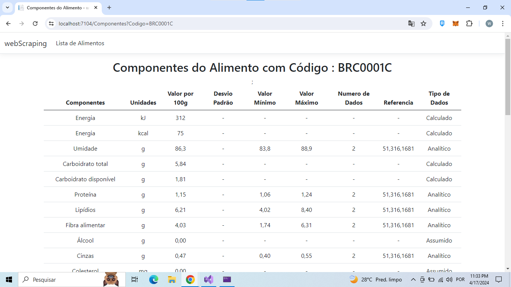
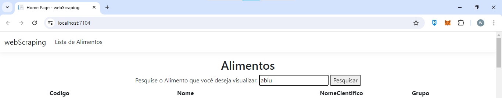
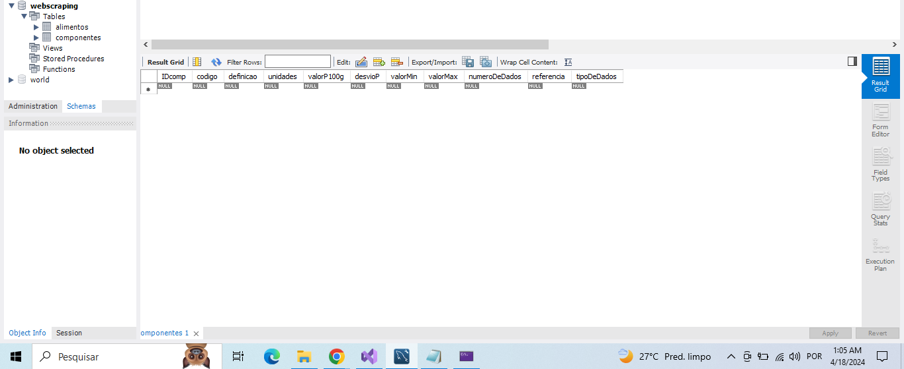

# # webScraping
- Descrição do Projeto
  O projeto se resume a um MVC que coleta dados do site https://www.tbca.net.br/base-dados/composicao_estatistica.php?pagina=1&atuald=1#, onde é resgatado todos os Alimentos listados nessa página. Além disso, cada alimento listado, contém componentes específicos, que também são resgatados nesta aplicação. Todos os dados estão sendo salvos em um banco de dados MySql. Ademais, todos os dados estão sendo retornados em views, com possibilidades de ser feita buscas por alimento específico no banco de dados.
  A dinâmica de para salvar os dados foi estruturada da seguinte forma: ao abrir a aplicação, o scraping é chamado para salvar todos os alimentos, caso estes alimentos já estejam salvos, o banco de dados não irá salva-los; os componentes de cada alimento só são salvos, quando o usuário clica no alimento da página principal, onde será direcionado para uma nova view chamando a função de cadastro dos componentes no banco e retornando na tela todos os itens, sendo assim, gera-se mais espaço no banco de dados por cadastrar apenas os componentes dos alimentos solicitados pelo usuário, deixando a aplicação mais performática. 

# Tecnologias Utilizadas

- Linguagem: C#
- Framework: .NET 6.
- Web Scraping:  Utilizado a biblioteca Html Agility Pack para a extração de dados.
- Banco de Dados: Utilizado MySql.
- Interface de Usuário: o Front End da aplicação foi desenvolvido com as Views disponíveis pelo framework, já que é um projeto no formato MVC.

## Funcionalidades

- Paginal principal com a listagem de todos os Alimentos e com opção no header da página para acessar a mesma: 
    

     
    
 

- Página dos componentes do alimento, com todos os dados, que é possível ser acessado após clicar no alimento na página principal:
   

    
   
 

- Componente de Pesquisa para pesquisar de algum alimento que possa estar cadastrado no banco de dados:
   

    
   
 
   

    
   
 

- Banco de Dados com a tabela Alimentos sem o resgate dos dados:
   

    
   
 
- Banco de Dados com a tabela Alimentos após o load da aplicação e resgate de dados:
   

    
   
 

- Banco de Dados com a tabela de Componentes antes do usuário selecionar algum alimento para pesquisar:
   

    
   
 
- Banco de Dados com a tabela de Componentes após cliente clicar em um alimento abrindo nova view, solicitando o resgate e o registro de dados no banco:
   

    
   
 
